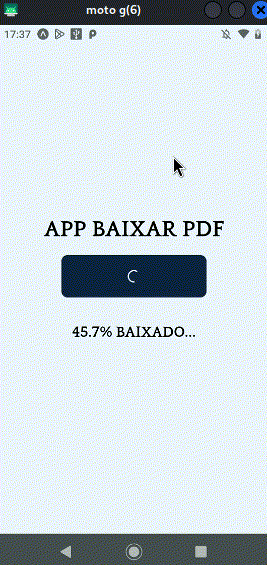

<h1 align="center">😇 Download PDF (tailwind, expo font, typescript, path import)</h1>

<p align="center">
  

  

  
  
  <a href="https://github.com/williamjayjay/Github-Blog/commits/master">
    
  </a>
    
   <a href="https://github.com/williamjayjay/downloadpdf-tailwind-gfont-pathimport/stargazers">
    
  </a>
</p>

<p align="center">Download PDF é um app que podemos testar a funcionalidade de baixar e visualizar PDF no React Native.<br/><strong>Está é apenas uma POC de React Native</strong>.</p>

<p align="center">

</p>

## 🥶 Sobre o projeto

Desenvolvi esse projeto, baseado em estudos sobre o funcionamento de arquivos PDF dentro do React Native. Tive a idéia de subir o código e organizar da melhor maneira possível tanto as estruturas de pastas quanto o código em si.

## Aplicativo:

**app:** Este APP, desenvolvido em React Native e inicializado com Expo, é responsável por fazer download de arquivo PDF com link estáticos por enquanto. Além disso, ele irá lidar com a biblioteca do expo, "sharing" para podermos visualizar esse PDF dentro do dispositivo.


## 🚀 Tecnologias

Principais tecnologias que utilizei para desenvolver esta aplicação mobile

- [React Native](https://reactnative.dev/)
- [Expo](https://expo.io/)
- [TypeScript](https://www.typescriptlang.org/)
- [NativeWind](https://www.nativewind.dev/)
- [TailwindCSS](https://tailwindcss.com/)
- [Expo Google Font](https://docs.expo.dev/develop/user-interface/fonts/)
- [Expo Sharing](https://docs.expo.dev/versions/latest/sdk/sharing/)


## Guia de inicialização

Para instalar e configurar uma cópia local, siga estas etapas simples:

### Guia de inicialização

Para inicializar o **mobile**, basta seguir as instruções abaixo:

1. Clone o repositório:
   ```sh
   git clone https://github.com/williamjayjay/downloadpdf-tailwind-gfont-pathimport
   ```

2. Instale os módulos do YARN:
   ```sh
   yarn install
   ```


## Usage

A parte de notícias está implementada utilizando mock, este CRUD está totalmente administrado pelo APP Atena. A parte do CRUD de usuário ainda está apenas como API REST 🥶 mas pretendo implementar a funcionalidade no APP.

## Roadmap

- [x] Fazer download de arquivo PDF fixo
  - [x] Exibir porcentagem de download do arquivo
  - [x] Abrir o arquivo em um leitor de PDF após o download

## APP UX

Desenvolvi o aplicativo com o mínimo de telas possível, concentrando todas as funcionalidades em uma única interface.

<p align="center">

</p>

## Gif demonstrando a funcionalidade implementada em pleno funcionamento.
<p align="center">
  
</p>